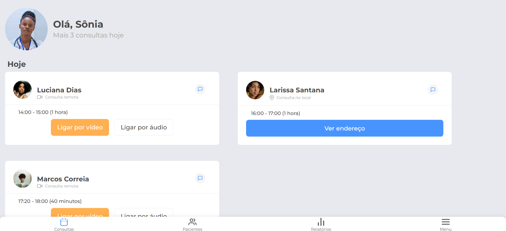

# MedBooking

Este é um projeto de uma página web simples chamada MedBooking, desenvolvida com o objetivo de estudos em HTML e CSS, focando em responsividade.

## Descrição

O projeto MedBooking simula uma interface para gerenciamento de consultas médicas. A interface exibe, em telas menores, uma barra de status com informações de rede e bateria, um cabeçalho de perfil do doutor com boas-vindas e uma lista de consultas organizadas por data. Cada consulta inclui informações sobre o paciente, o tipo de consulta (remota ou presencial), horário e opções de chamada por vídeo ou áudio.

## Estrutura de Arquivos

- `index.html`: Contém a estrutura HTML da página.
- `reset.css`: Um arquivo CSS para redefinir os estilos padrão do navegador.
- `style.css`: Contém os estilos CSS específicos para a página.

## Foco na Responsividade

O projeto foi desenvolvido com um foco especial em responsividade para garantir uma boa experiência de usuário em diferentes dispositivos e tamanhos de tela. Algumas das técnicas utilizadas incluem:

- **Unidades Flexíveis:** Uso de unidades como `em` e `%` para dimensões e espaçamentos.
- **Media Queries:** Utilização de media queries para aplicar estilos diferentes em tamanhos de tela variados. Por exemplo, o layout é ajustado para telas maiores como desktops e reduzido para dispositivos móveis.
- **Flexbox:** Implementação do Flexbox para facilitar o alinhamento e distribuição de elementos dentro de contêineres flexíveis.
- **Imagens Responsivas:** Ajuste das imagens para diferentes tamanhos de tela, garantindo que não fiquem distorcidas ou ocupem muito espaço em telas menores.

## Tecnologias Utilizadas

- HTML5
- CSS3 (com Flexbox e Media Queries)

## Como Visualizar

1. Faça o download ou clone este repositório.
2. Abra o arquivo `index.html` em um navegador web.
3. Clique [aqui](#https://med-booking.vercel.app/#) para ver o deployment do site.

## Observações

Este projeto é destinado exclusivamente para fins de estudo e prática em desenvolvimento web. Não possui objetivo profissional ou comercial e não está licenciado.

## Contribuição

Contribuições são bem-vindas! Sinta-se à vontade para abrir issues e pull requests para melhorar este projeto.

## Autor & Contato

Este projeto é um trabalho em andamento e faz parte da minha formação como desenvolvedor. Se você tiver sugestões ou quiser entrar em contato, pode me encontrar em:

- **Email:** fabiooprogramador@gmail.com
- **LinkedIn:** [Fabio Fernandes](https://www.linkedin.com/in/fabiogmf/)

Agradeço por visitar meu projeto e espero que goste da experiência de navegação pelo Alura Books! 🚀📚

Criado com 💙 por Fabio Fernandes
